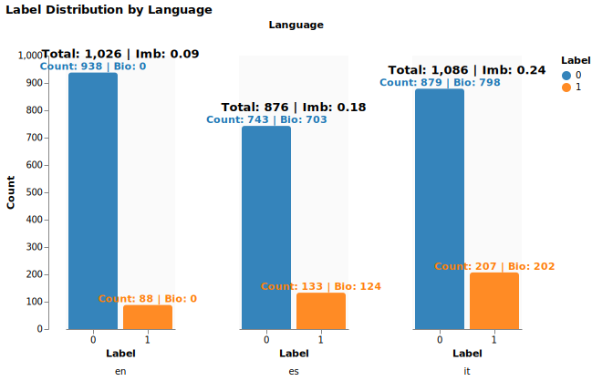
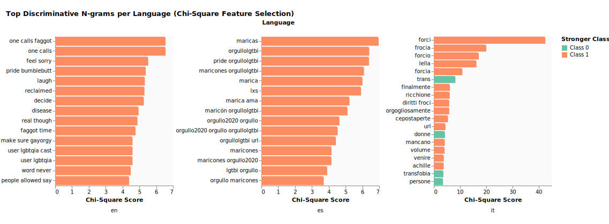
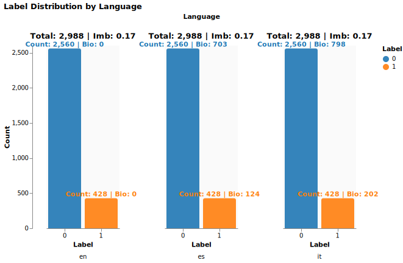
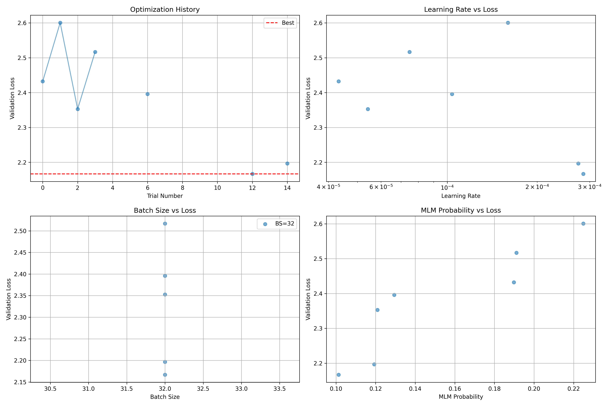
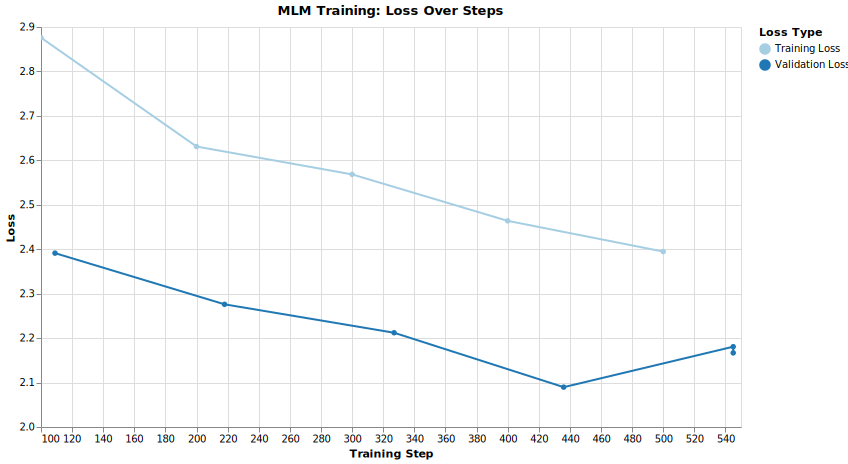
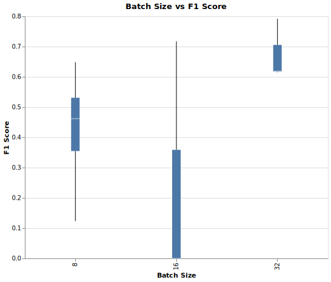
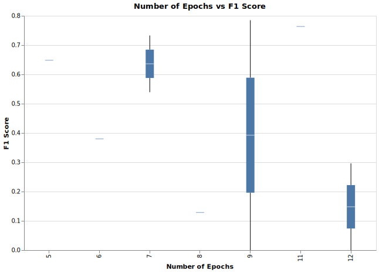
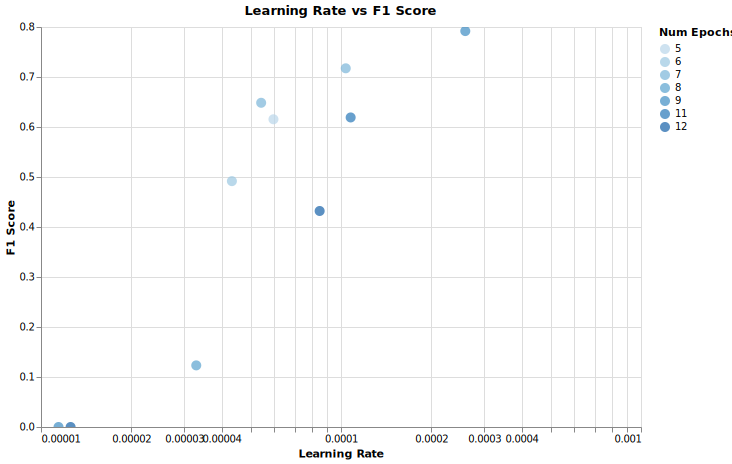
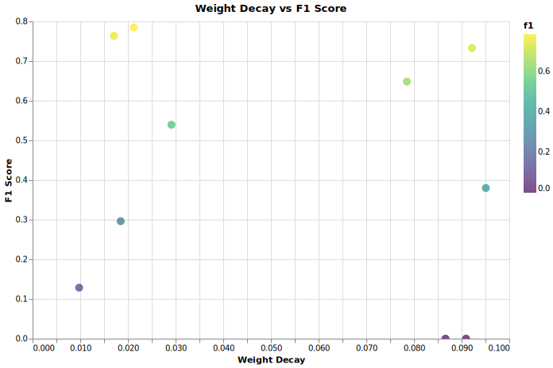

# MultiPRIDE-Evalita-2026
MultiPRIDE: Multilingual Automatic Detection of Reclamation of Slurs in the LGBTQ+ Context

Access to the data is available through [MultiPRIDE Organizers](https://multipride-evalita.github.io/).

```commandline
git clone https://github.com/rbg-research/MultiPRIDE-Evalita-2026.git
cd MultiPRIDE-Evalita-2026
```

# Notebooks
## Contents

| S.No |                   Division                    |                                                              Description                                                               |                              Link                               |
|:----:|:---------------------------------------------:|:--------------------------------------------------------------------------------------------------------------------------------------:|:---------------------------------------------------------------:|
|  1   |              Frequency Analysis               |                          Distributional Analysis of Data and Label, Class Specific Feature Importance Scoring                          |      [Link](notebooks/0_Descriptive-Analytics-Data.ipynb)       |
|  2   |              Frequency Analysis               | Baseline setup with Conventional ML Algorithms, Language Specific and Multi-lingual Classification, Stratified 5-fold Cross Validation |       [Link](notebooks/1_Baseline-Conventional-ML.ipynb)        |
|  3   |              Contextual Analysis              |    Deep Embedding methods followed by Conventional ML Algorithms, Multi-lingual Classification, Stratified 5-fold Cross Validation     |       [Link](notebooks/1_Baseline-Conventional-ML.ipynb)        |
|  4   |              Contextual Analysis              |                              Fine-tuning Multilingual Language Models, Stratified 5-fold Cross Validation                              |              [Link](notebooks/3_Finetune-LM.ipynb)              |
|  5   |          Contextual Analysis - GenAI          |                            Prompt Analysis w.r.t Zero-shot and Few-shot Multilingual Large Language Models                             |            [Link](notebooks/2_Baseline-GenAI.ipynb)             |
|  6   | Augmentation with GenAI + Contextual Analysis |                                  Data Augmentation, Fine-tuning Multilingual LM with Augumented Data                                  | [Link 1](notebooks/4_Data-Augumentation-Back-Translation.ipynb) [Link 2](notebooks/5_Finetune-LM-with-Augmented-Data.ipynb)|


# Label Distribution


# Frequency Analysis: Chi-Square Feature Selection


# Label Distribution on Augmented Data


# MLM Fine-Tuning (Transductive Transfer Learning)


# Classification Fine-Tuning (Transductive + Inductive Transfer Learning)



||    |
|:--:|:--:|
||    |


# Installation

```commandline
sudo snap install astral-uv --classic
sudo ufw allow 9999 # for vllm hosting
```
#### Python and Libraries
```commandline
sudo add-apt-repository ppa:deadsnakes/ppa
sudo apt update
sudo apt install -y python3.10 python3.10-dev python3.10-distutils
wget https://bootstrap.pypa.io/get-pip.py
source ~/.bashrc
python3.10 get-pip.py
echo 'export PATH="$HOME/.local/bin:$PATH"' >> ~/.bashrc
source ~/.bashrc
pip3.10 install -U pip
rm get-pip.py
```

#### Virtual Environment
```commandline
pip3.10 install virtualenv
virtualenv --python=python3.10 "$HOME"/environments/multipride
source "$HOME"/environments/multipride/bin/activate
```

#### Jupyter Notebook
```commandline
pip install jupyter
pip install ipykernel
python -m ipykernel install --user --name=multipride
```

#### Requirements
```commandline
pip install uv
pip3 install torch torchvision --index-url https://download.pytorch.org/whl/cu126
uv pip install vllm --torch-backend=auto
pip install -r requirements.txt
```
